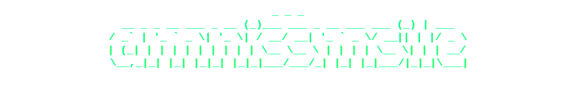

<div align="center">
  
</div>

<div align="center">
  
</div>

---

```ts
const stalis = {
  name    : "Stalis Ahmad Sholeh",
  role    : "Fullstack Web Developer",
  base    : "Indonesia 🇮🇩",
  school  : "EEPIS — Informatics Engineering",
  stack   : ["Laravel", "React", "Next.js", "Flutter", "Spring Boot"],
  db      : ["MySQL", "PostgreSQL", "Firebase"],
  contact : "salisahmad48@email.com",
  motto   : "Build what you love, love what you build.",
};
```

---

### 🔧 Stack


---

### 📊 Stats

<div align="center">
  
  
</div>

<div align="center">
  
</div>

---

### 📫 Connect

[](https://www.linkedin.com/in/aminssmile)
[](https://github.com/aminssmilee)
[](mailto:salisahmad48@email.com)

---

<div align="center">
  <sub>⚡ made with focus & coffee</sub>
</div>