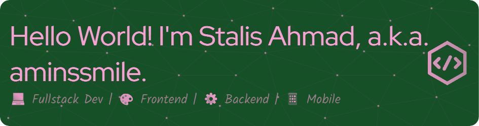

  

## 👋 Hello, I'm **Stalis Ahmad Sholeh**

Hey there! I'm a **tech enthusiast** and **aspiring web developer** from **Lamongan, East Java, Indonesia**.  
Currently, I'm on an exciting academic journey at **Politeknik Elektronika Negeri Surabaya**, majoring in **Informatics Engineering**.

---

### 🚀 About Me

My passion for **technology and coding** knows no bounds.  
Beyond the world of programming, I find myself deeply immersed in:

- 🎨 UI/UX Design  
- 🎮 Game Development  
- 🤖 Artificial Intelligence & Machine Learning  

I believe that in today's fast-paced digital world, being a **lifelong learner** is not just a choice but a necessity.  
Let’s connect and explore this ever-evolving world of tech together!

---

### 🛠️ Skills & Tech Stack

---

### 📈 GitHub Stats

  

---

### 📫 Let’s Connect!

  
  
  
  

---

> _"Build what you love, love what you build."_  
> — **Stalis Ahmad Sholeh**
